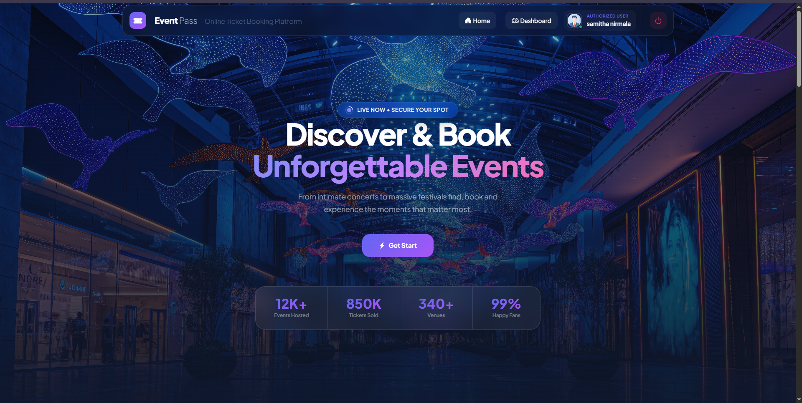
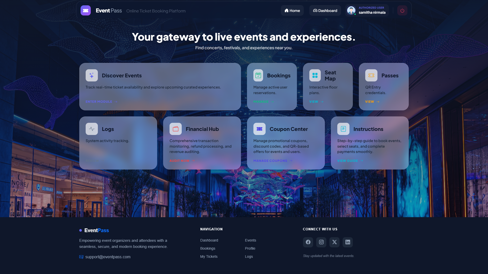
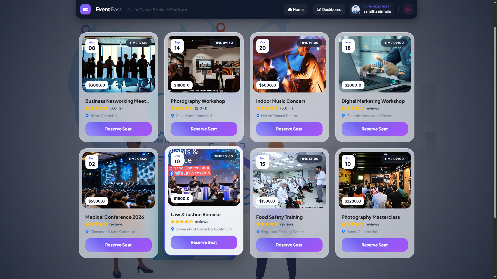
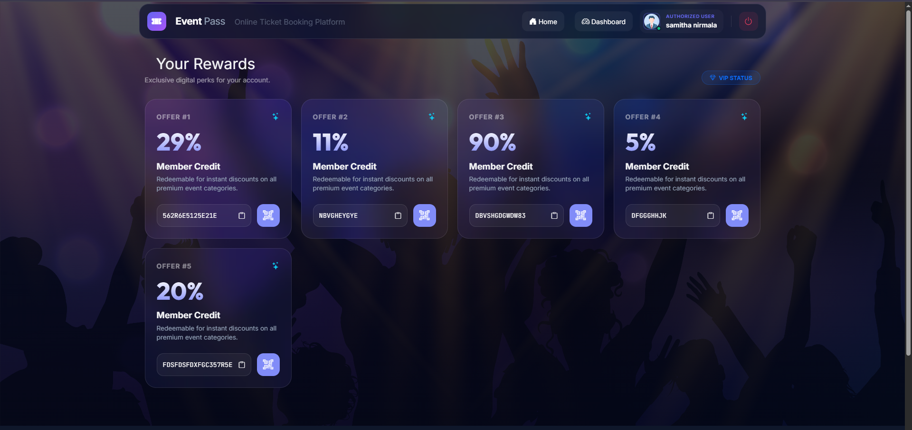
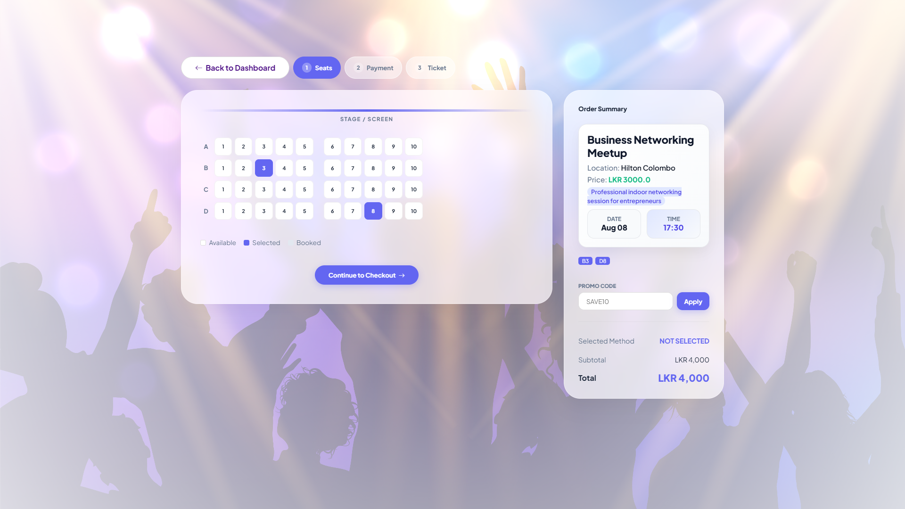
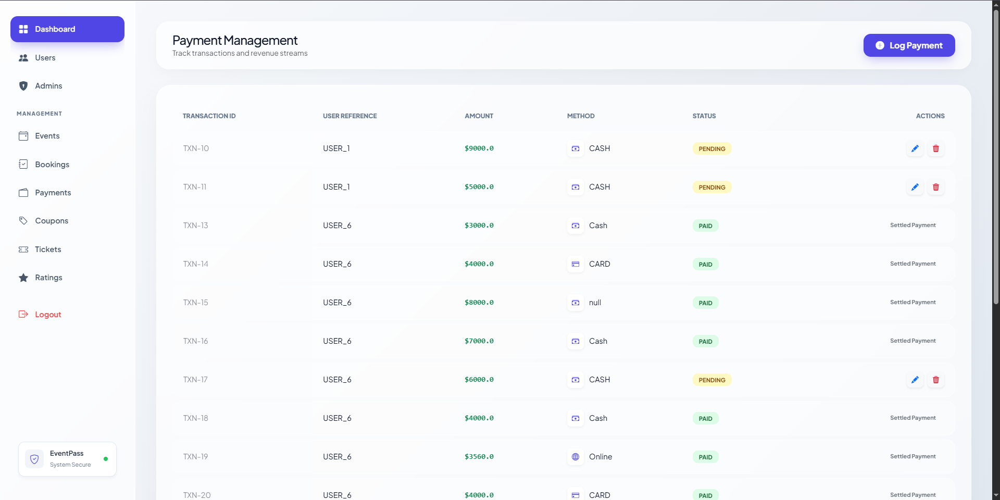
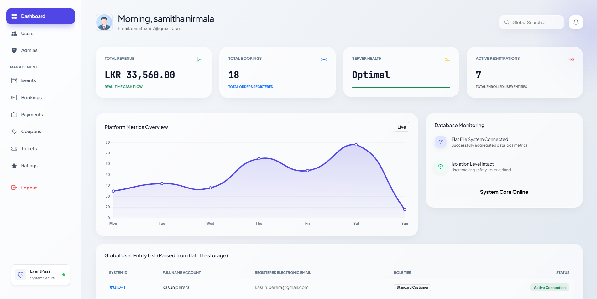
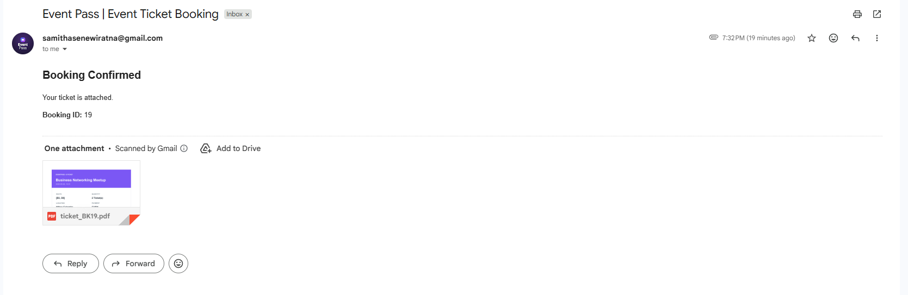
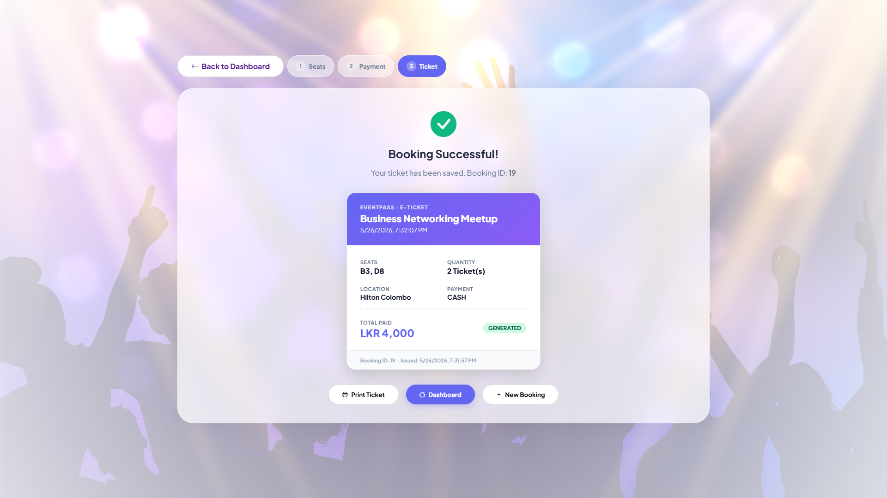
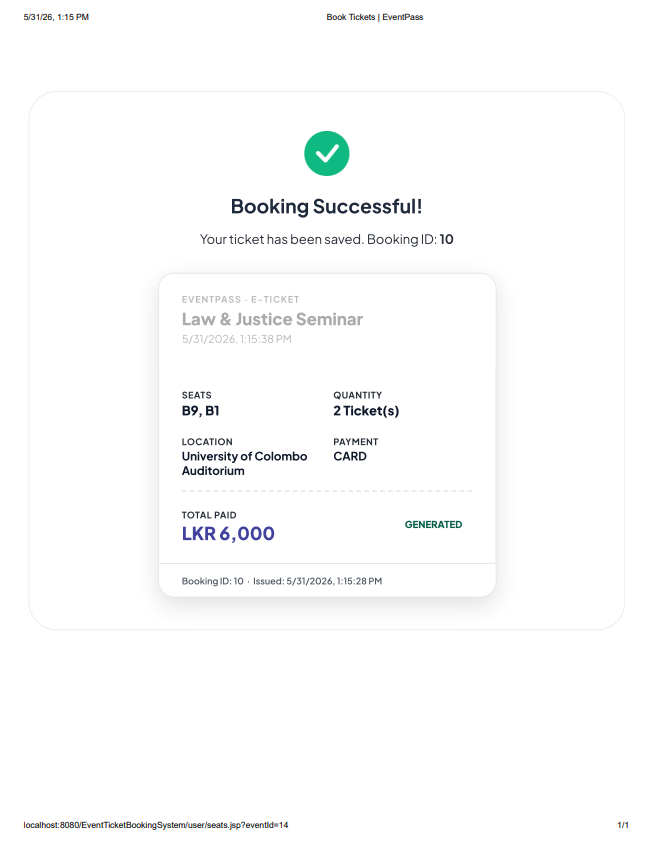

  

<h1 align="center"> Event Ticket Booking System</h1>

## Sri Lanka Institute of Information Technology  
**Module:** Object Oriented Programming | SE1020  
**Project Group:** MTR-Y1S2-MTR29  

---

##  Project Overview

**Event Pass** is a web-based event ticket booking and management system designed to simplify event organization and ticket purchasing.

### Key Capabilities:
- Online event browsing and booking
- Secure user authentication
- Ticket generation with unique IDs
- Email confirmation with **automatically generated PDF tickets**
- Coupon and discount management
- Event reviews and ratings
- Admin dashboard for full system control

---

##  Main Modules

- Admin Management  
- Booking Management  
- Event Management  
- Payment Management  
- Ticket Management  
- Coupon Management  
- Review & Rating Management  
- User Management  

---

##  System Features

- User registration & login system  
- Event creation and scheduling  
- Ticket booking with seat management  
- Coupon validation system  
- Payment tracking system  
- **Automated email notifications after booking confirmation**  
- **PDF ticket generation with unique QR/Serial ID**  
- Ticket generation (digital pass)  
- Booking history tracking  
- Review and rating system  

---

##  Email & PDF Ticket System

- After a successful booking, the system automatically:
  - Generates a **unique digital ticket**
  - Creates a **PDF ticket file**
  - Sends an **email confirmation to the user**
- Email includes:
  - Booking details
  - Event information
  - Attached PDF ticket
- Ensures secure and paperless ticket delivery

---

##  Technologies Used

- **Frontend:** HTML, CSS, JavaScript  
- **Backend:** Java Servlet  
- **Data Storage:** Text Files (.txt / .csv)  
- **PDF Generation:** Java PDF Library (e.g., iText / Apache PDFBox)  
- **Email Service:** JavaMail API  
- **Version Control:** Git & GitHub  

---

##  System Architecture

### Frontend
HTML, CSS, and JavaScript are used to build a responsive and interactive user interface.

### Backend
Java Servlets handle HTTP requests, business logic, PDF creation, and email sending.

### Data Storage
All system data (users, bookings, events, payments, coupons) are stored using structured text files with Java I/O streams.

---

##  Functional Summary

### Customer
- Register & login
- Browse and book events
- Apply coupons
- View booking history
- Download tickets
- Receive **email with PDF ticket**
- Submit reviews

### Admin
- Manage users and events
- Control bookings and payments
- Moderate reviews
- Manage system data

### Organizer
- Create and update events
- Monitor seat availability
- View feedback and ratings

---

##  Individual Contributions

Each member implemented a core module following OOP principles:

- **Admin & User Management**
- **Booking System**
- **Coupon System**
- **Event Management**
- **Payment Processing**
- **Review System**
- **Ticket Generation with PDF & Email Integration**

---

##  OOP Concepts Applied

- **Encapsulation** – Data hiding using private fields  
- **Inheritance** – Shared structure across system models  
- **Polymorphism** – Role-based behavior variations  
- **Abstraction** – Hidden backend file handling logic  

---

##  Conclusion

This system demonstrates a complete full-stack event management platform using Java Servlet technology. It reduces manual booking operations, improves efficiency, and provides a scalable foundation for future enhancements such as:

- Mobile application support  
- Real-time analytics  
- Cloud-based deployment  
- Online streaming integration  

---

##  License

This project is developed for academic purposes at SLIIT.

---

## 📸 Screenshots

### 🏠 Homepage

### 👤 User Dashboard

### 🎫 Events Page

### 🎫 Coupon Page

### 🎟️ Ticket Booking

### 💳 Payment Page

### 🧾 Admin Dashboard

### 📧 Email Confirmation (PDF Ticket)

### 🎫 Ticket Generation

